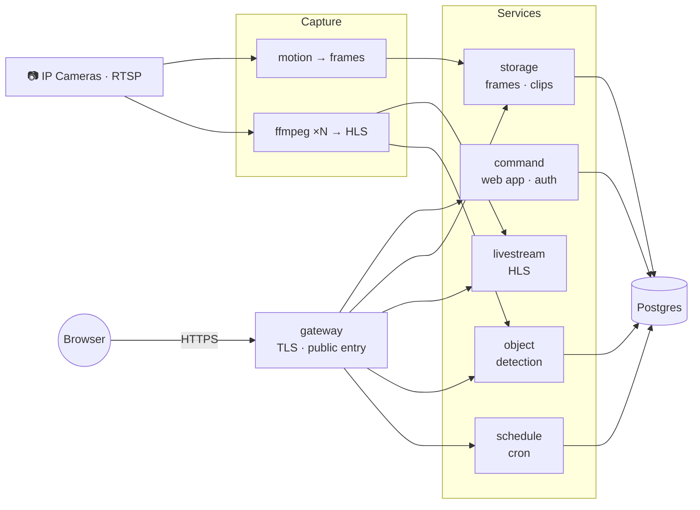

# Chimera


Microservices security-camera system for RTSP/IP cameras.



## Services

| | |
|---|---|
| [command](command) | Web app · auth · RBAC · sessions |
| [storage](storage) | Saves motion frames · builds clips & zips · quota |
| [livestream](livestream) | Per-camera HLS streams |
| [object](object) | YOLOX detection on feeds · webhook alerts |
| [schedule](schedule) | Cron jobs (auto-cleanup, etc.) |
| [gateway](gateway) | Public entrypoint · reverse proxy · TLS |
| [memory](memory) | Shared state across a pm2 cluster |

Each service is toggled by `<prefix>_ON`. The gateway is the only public port.

**Shared:** [lib](lib) (helpers every service imports) · [chimera](chimera) (boot scripts)<br>
**Bundled in the image:** motion · ffmpeg · heartbeat · postgres

## Quick start

> **Docker only.** The image bundles motion, ffmpeg, Node, pm2 and pins `TZ=UTC` (required — non-UTC misaligns clips/frames). Postgres runs as a side container.

```bash
cp env.example .env                    # fill in values
cp motion.conf.example motion.conf
# add cameraconf/camN.conf per camera  (see cameraconf/camera.conf.example)

npm run docker:build                   # runs preflight first — bad config blocks the build
npm run docker:up
```

**First run:** no users exist yet. Open the gateway and create the first admin from the setup screen.

<details>
<summary><b>Commands</b></summary>

| | |
|---|---|
| `npm run preflight` | Seed & validate config |
| `npm run docker:up` | Start |
| `npm run docker:down` | Stop |
| `npm run docker:logs` | Tail logs |
| `npm run docker:rebuild` | Redeploy |
| `npm run docker:delete` | Stop + wipe volumes |

</details>

<details>
<summary><b>Boot & scaling</b></summary>

- **Boot chain** ([entrypoint.sh](entrypoint.sh), aborts on first failure): ACME dir → `validateEnvVars.js` → `prepareDatabase.js` → `pm2-runtime`.
- One pm2 process per enabled service ([pm2.config.js](pm2.config.js)); crashes restart per-process, no cross-service chaining.
- `object` and `memory` are single-instance; the rest honor `chimeraInstances`.
- **`chimeraInstances`:** `1` = single process. `max` / `0` / `-1` / any integer `>1` = cluster — forces `memory_ON=true` so instances share state via the memory socket. Any other value is rejected at boot.

</details>

<details>
<summary><b>TLS renewal</b></summary>

`certbot_ON=true` auto-issues + renews Let's Encrypt certs (HTTP-01, needs `gateway_PORT=80`); the gateway self-restarts nightly to load them. Disable for BYO certs / upstream TLS.

</details>

<details>
<summary><b>Database schema</b></summary>

Created by [prepareDatabase.js](chimera/prepareDatabase.js): tables/indexes are created if missing, and an existing table's column names (not types) are checked against what's expected rather than assumed correct. Full config in [env.example](env.example).

| Tables | Owner |
|---|---|
| `frame_files` · `frame_deletes` | storage |
| `auth` · `sessions` | command |
| `objects_detected` | object |
| `task_runs` | schedule |

**v6.0.0:** the `auth` table shape changed — there is no upgrade path from a v5 database. `prepareDatabase.js` now exits `1` and lists missing columns instead of booting against a stale schema. Run `npm run docker:delete` to drop the volume and start fresh (this destroys existing data).

</details>
