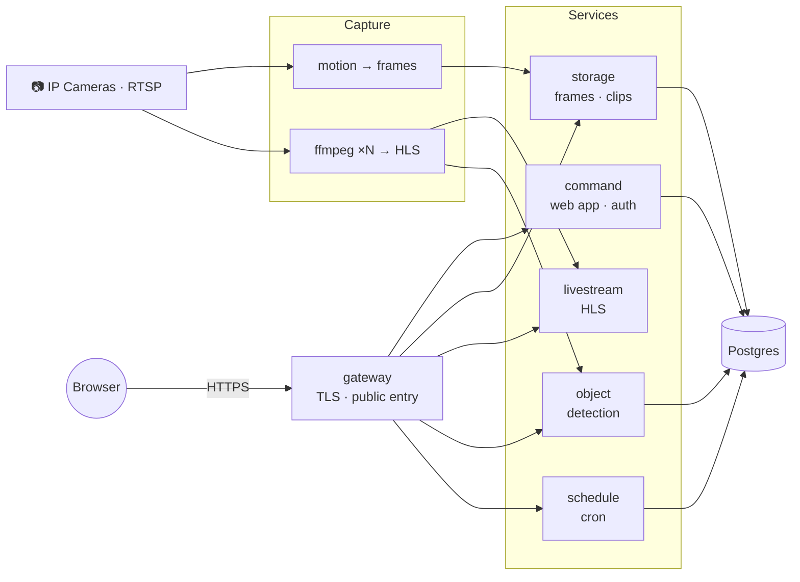

# Chimera


Microservices security-camera system for RTSP/IP cameras.


```mermaid
flowchart LR
    user(("Browser"))
    cam["📷 IP Cameras · RTSP"]

    gw["gateway<br/>TLS · public entry"]

    subgraph cap [Capture]
      motion["motion → frames"]
      ff["ffmpeg ×N → HLS"]
    end

    subgraph svcs [Services]
      cmd["command<br/>web app · auth"]
      store["storage<br/>frames · clips"]
      live["livestream<br/>HLS"]
      obj["object<br/>detection"]
      sched["schedule<br/>cron"]
    end

    db[("Postgres")]

    user -->|HTTPS| gw
    cam --> motion & ff
    motion --> store
    ff --> live & obj
    gw --> cmd & store & live & obj & sched
    store & cmd & obj & sched --> db
```

## Services

| | |
|---|---|
| [command](command) | Web app · auth · RBAC · sessions |
| [storage](storage) | Saves motion frames · builds clips & zips · quota |
| [livestream](livestream) | Per-camera HLS streams |
| [object](object) | YOLOX detection on feeds · webhook alerts |
| [schedule](schedule) | Cron jobs (auto-cleanup, etc.) |
| [gateway](gateway) | Public entrypoint · reverse proxy · TLS |
| [memory](memory) | Shared state across a pm2 cluster |

Each service is toggled by `<prefix>_ON`, except the gateway — it is the entrypoint the bundled stack publishes ports for, so it always runs. Some also take `<prefix>_PROXY_ON` to be routed through the gateway; set both `true` on a single-machine install.

**Shared:** [lib](lib) (helpers every service imports) · [chimera](chimera) (boot scripts)<br>
**Bundled in the image:** motion · ffmpeg · heartbeat · postgres

## Quick start

> **Docker only.** The image bundles motion, ffmpeg, Node and pm2, and pins `TZ=UTC`. Postgres runs as a side container.

**What you need on your machine:**

- **Docker**, with Compose **v2.23.1 or newer**. Check with `docker compose version` — older ones cannot read `secrets.environment`.
- **Node 22+ and npm 7+**. Every `npm run` script below runs on your machine — the config check and the `docker:*` wrappers. The services themselves all run in the container.
- **`git` and a connection to github.com**. The services are npm workspaces, so `npm install` pulls all of their packages onto your machine even though only the container runs them. `heartbeat` comes straight from GitHub.

### 1 · Install

```bash
npm install
```

### 2 · Write the config

You fill in three things: `.env`, `motion.conf`, and one file per camera in `cameraconf/`.

**Guided** — asks for values that need one and skips blank optional keys; writes `motion.conf` / `cameraconf/` only if storage, livestream, or object is on, otherwise just `.env`. Piped or non-interactive stdin runs report-only and writes nothing:

```bash
npm run preflight
```

**By hand** — same three files, you edit them yourself. In the copied `.env` most right-hand sides are a description of the value, not a value:

```bash
cp env.example .env
cp motion.conf.example motion.conf
cp cameraconf/camera.conf.example cameraconf/cam1.conf   # one per camera
```

A camera's file holds its address, username and password. Every `.env` value is explained beside it in [env.example](env.example). Lines marked `# default` are already filled in with the right value for Docker — leave them alone.

Every service shares one container, so each `<prefix>_HOST` is just loopback plus that service's own port — the `http://127.0.0.1:8081` half of the example, not the domain half. `gateway_HOST` is the exception: it is the address you type in a browser.

### 3 · Build and start

```bash
npm run docker:build
npm run docker:up
```

The build re-reads `.env` first and refuses to run on a value that is missing, the wrong type, or the wrong shape. The error names the value; [env.example](env.example) says what it wants.

### 4 · Open it

Go to your `gateway_HOST` in a browser, adding `gateway_PORT` if the address does not already carry one — `http://192.168.1.50:8080`.

No users exist yet, so you land on a setup screen. It wants a username, a password, and the `setup_TOKEN` from your `.env`. That gets you the first admin account.

**Your footage** lives in a Docker volume, not in a folder you can browse. Pick a camera and a time range in the web app, and it builds an MP4 or a zip you download from the same page.

**Adding a camera** is a new `.conf` in `cameraconf/` plus `npm run docker:restart`. Chimera reads every `.conf` in that folder at startup, so there is no second list to keep in step.

<details>
<summary><b>HTTP or HTTPS?</b> — the login cookie has to agree with it</summary>

Look at the address you type in the browser, then match it:

- **`http://`** — set `command_COOKIE_SECURE=false`. Give `gateway_HOST` an explicit `http://` prefix (`http://192.168.1.50:8080`) and leave `gateway_HTTPS_Redirect` and `certbot_ON` at `false`.
- **`https://`** — set `command_COOKIE_SECURE=true`, however the certificate gets there.

Get it backwards and you pay either way: `true` on plain HTTP breaks login outright, `false` on HTTPS quietly drops the `Secure` flag from your login cookies.

An HTTPS port is published either way — `gateway_PORT_SECURE`, or 443 when you leave it blank — so name a free port if something else already holds 443.

The config check catches `false` while something says HTTPS, and it catches `true` on an explicit `http://` deploy — but only once `gateway_HOST` carries that `http://` prefix itself. Left bare, the host reads as HTTPS by default, so the same `true` there is ambiguous rather than provably wrong, and the check only warns instead of blocking. Either error names the three settings that could have said so — `gateway_HOST`'s scheme, `gateway_HTTPS_Redirect=true`, `certbot_ON=true` — but not which one did. Nothing is checked when `command_ON=false`, or when `gateway_HOST` is blank or points at this machine (`localhost`, `127.0.0.1`, `::1`).

Why the cookie can't just read the request: [command](command#config).

</details>

<details>
<summary><b>It built fine but the container keeps restarting</b></summary>

Run `npm run docker:logs` — it names the value it stopped on.

A build can pass and still fail at startup, because some checks only run once the container is up: the `*_URL` addresses, the file paths, and the cookie check again in case `.env` changed after the build.

**Or it says `CANNOT READ`.**

- **Ownership** is what produces `CANNOT READ` at startup, and only on Linux, including a folder inside WSL such as `\\wsl$\Ubuntu\home\you\chimera`. On a Windows or Mac drive Docker Desktop sets ownership for you.
- **File mode** is checked before the build, not at startup, and applies everywhere except a Windows drive such as `C:\Users\you\chimera` or `/mnt/c/Users/you/chimera` — those report a fixed mode whatever you `chmod`, so Chimera does not look. macOS is checked like Linux.

Inside the container the app runs as user `node`, uid 1000, and reads your config files as that user. Copy them with plain `cp`, never `sudo`, so they stay yours.

**`.env`** holds your passwords and tokens, and `cp` leaves it world-readable at `644`. If your own uid is already 1000 — most single-user installs, check with `id -u` — tightening the mode is all it needs:

```sh
chmod 640 .env
```

Otherwise hand it to group 1000 as well:

```sh
sudo chown "$USER":1000 .env && sudo chmod 640 .env
```

**Each `cameraconf/*.conf`** holds `netcam_userpass`, a camera password, and `cp` leaves it world-readable at `644`. The container fixes the group on every start, so only the mode needs tightening:

```sh
chmod 640 cameraconf/*.conf
```

**`motion.conf`** holds no secret and is fine at the default `644`.

`chmod 644 .env` clears the error too, but it opens your passwords to every account on the machine — so `npm run docker:build`, `docker:up` and `docker:restart` all stop until you put it back.

</details>

<details>
<summary><b>Why signing in leaves a second cookie</b></summary>

Your first successful login leaves a second cookie in that browser for a year. It only marks the device as one you have used before, so someone guessing your password elsewhere cannot lock you out of it. What it does, and how to void it if the device is lost: [login limits](command#login-limits).

</details>

## Reference

<details>
<summary><b>Commands</b></summary>

`npm run` lists every script; the `docker:*` ones wrap `docker compose` ([package.json](package.json)).

</details>

<details>
<summary><b>Boot & scaling</b></summary>

- **Boot chain** ([entrypoint.sh](entrypoint.sh), aborts on first failure): ACME dir → `validateEnvVars.js` → `prepareDatabase.js` → `pm2-runtime`.
- One pm2 process per enabled service ([pm2.config.js](pm2.config.js)); crashes restart per-process, no cross-service chaining.
- `object` and `memory` are single-instance; the rest honor `chimeraInstances`.
- A cluster (`chimeraInstances` != `1`) needs both `chimera_MEM_LIMIT` and `chimera_PIDS_LIMIT` raised in `.env`, or it's OOM-killed at boot with no explanatory message. Budget pids well past the process count — the cgroup counts threads, and motion's `on_picture_save` forks five processes per saved frame.
- In production pm2 writes no log files; everything streams to container stdout, rotated by the `json-file` driver (`npm run docker:logs`).
- `chimera` has no `DAC_OVERRIDE`, so `docker compose exec chimera pm2 list` fails as root — use `docker compose exec -u node chimera pm2 list`.

</details>

<details>
<summary><b>TLS renewal</b></summary>

`certbot_ON=true` auto-issues + renews Let's Encrypt certs over HTTP-01; the gateway self-restarts nightly to load them. Disable for BYO certs / upstream TLS.

Two things have to be true, or no certificate is ever issued:

- **`gateway_HOST` is a public domain name pointing at this machine.** certbot asks for that name without the scheme and port, so the LAN address `http://192.168.1.50:8080` above becomes a request for `192.168.1.50` — never issued.
- **`gateway_PORT=80`, open through your router.** The challenge arrives as plain HTTP on port 80, and that is the only port published. The config check stops the build on any other port.

Start the stack with `npm run docker:up`, not a bare `docker compose up`. certbot runs in its own container, and the script drops it when `certbot_ON=false` ([chimera/compose.js](chimera/compose.js)); compose alone leaves it sitting idle.

</details>

<details>
<summary><b>Database schema</b></summary>

[prepareDatabase.js](chimera/prepareDatabase.js) creates the tables and indexes if they are missing, and checks an existing table's column names (not types) against the expected v6 shape rather than assuming it is right. Table and index list: [chimera](chimera#preparedatabasejs). Connection settings: [env.example](env.example).

</details>
