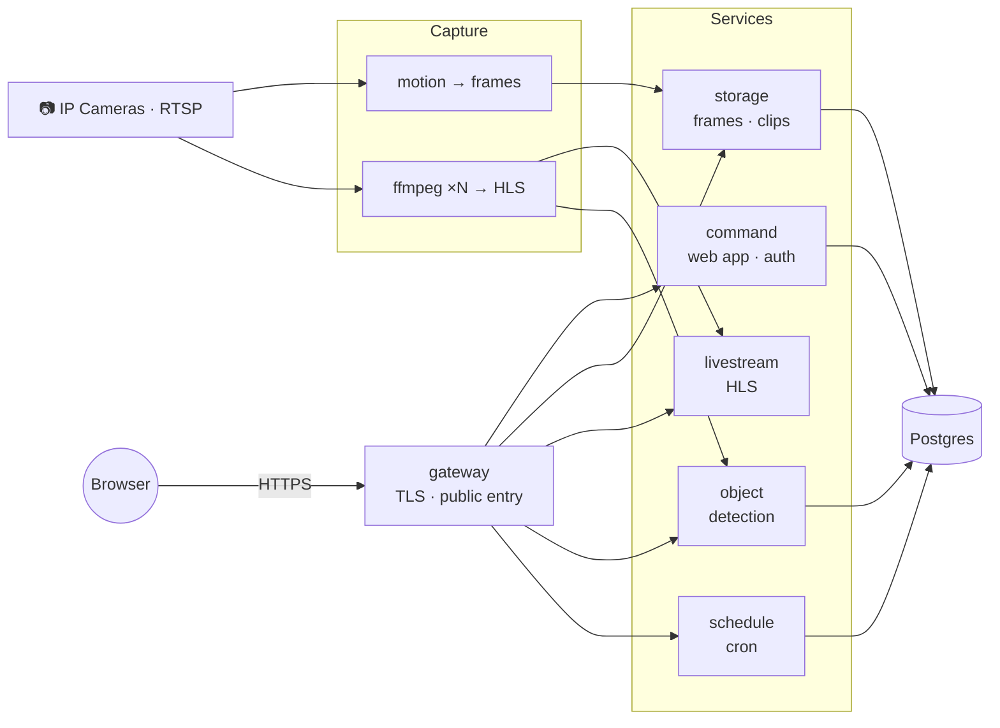

# Chimera


Microservices security-camera system for RTSP/IP cameras.


```mermaid
flowchart LR
    user(("Browser"))
    cam["📷 IP Cameras · RTSP"]

    gw["gateway<br/>TLS · public entry"]

    subgraph cap [Capture]
      motion["motion → frames"]
      ff["ffmpeg ×N → HLS"]
    end

    subgraph svcs [Services]
      cmd["command<br/>web app · auth"]
      store["storage<br/>frames · clips"]
      live["livestream<br/>HLS"]
      obj["object<br/>detection"]
      sched["schedule<br/>cron"]
    end

    db[("Postgres")]

    user -->|HTTPS| gw
    cam --> motion & ff
    motion --> store
    ff --> live & obj
    gw --> cmd & store & live & obj & sched
    store & cmd & obj & sched --> db
```

## Services

| | |
|---|---|
| [command](command) | Web app · auth · RBAC · sessions |
| [storage](storage) | Saves motion frames · builds clips & zips · quota |
| [livestream](livestream) | Per-camera HLS streams |
| [object](object) | YOLOX detection on feeds · webhook alerts |
| [schedule](schedule) | Cron jobs (auto-cleanup, etc.) |
| [gateway](gateway) | Public entrypoint · reverse proxy · TLS |
| [memory](memory) | Shared state across a pm2 cluster |

Each service is toggled by `<prefix>_ON`, except the gateway — it publishes the stack's ports, so it always runs. Most also take `<prefix>_PROXY_ON` to be routed through the gateway; set both `true` on a single-machine install.

**Shared:** [lib](lib) (helpers every service imports) · [chimera](chimera) (boot scripts)<br>
**Bundled in the image:** motion · ffmpeg · heartbeat · postgres

## Quick start

> **Docker only.** The image bundles motion, ffmpeg, Node and pm2, and pins `TZ=UTC`. Postgres runs as a side container.

**What you need on your machine:**

- **Docker**, with Compose **v2.23.1 or newer** (`docker compose version`). Older ones cannot read `secrets.environment`.
- **Node 22+ and npm 7+**, for the `npm run` scripts below. The services themselves run in the container.
- **`git` and a connection to github.com** — `npm install` pulls every workspace's packages, and `heartbeat` comes straight from GitHub.

### 1 · Install

```bash
npm install
```

### 2 · Write the config

You fill in three things: `.env`, `motion.conf`, and one file per camera in `cameraconf/`.

**Guided** — asks only for values that need one, and writes `motion.conf` / `cameraconf/` only if storage, livestream, or object is on. Non-interactive stdin runs report-only and writes nothing:

```bash
npm run preflight
```

**By hand** — same three files, you edit them yourself. In the copied `.env` most right-hand sides are a description of the value, not a value:

```bash
cp env.example .env
cp motion.conf.example motion.conf
cp cameraconf/camera.conf.example cameraconf/cam1.conf   # one per camera
```

A camera's file holds its address, username and password. Every `.env` value is explained beside it in [env.example](env.example); lines marked `# default` are already correct for Docker — leave them alone.

Every service shares one container, so each `<prefix>_HOST` is loopback plus that service's own port — the `http://127.0.0.1:8081` half of the example, not the domain half. `gateway_HOST` is the exception: it is the address you type in a browser.

### 3 · Build and start

```bash
npm run docker:build
npm run docker:up
```

The build re-reads `.env` first and refuses to run on a missing or malformed value. The error names the value; [env.example](env.example) says what it wants.

### 4 · Open it

Go to your `gateway_HOST` in a browser, adding `gateway_PORT` if the address does not already carry one — `http://192.168.1.50:8080`.

No users exist yet, so you land on a setup screen. It wants a username, a password, and the `setup_TOKEN` from your `.env`. That gets you the first admin account.

**Your footage** lives in a Docker volume, not a folder you can browse. Pick a camera and a time range in the web app, and it builds an MP4 or zip you download from the same page.

**Adding a camera** is a new `.conf` in `cameraconf/` plus `npm run docker:restart`. Chimera reads every `.conf` in that folder at startup, so there is no second list to keep in step.

**The language picker** sits on the login page and under Account. It offers multiple languages, and the choice is stored on your account, so it follows you to any device.

Chimera ships no webfont beyond Latin, Cyrillic and Greek, so Chinese, Japanese, Korean, Hindi and Gujarati render in whatever font the viewer's own device provides. Windows, macOS, iOS and Android all carry those scripts. A bare Linux desktop with no CJK or Indic fonts installed will show boxes instead of glyphs — install the matching Noto family to fix it.

`cronstrue`, the library that turns a schedule's cron expression into a sentence, has no Hindi or Gujarati translation, so those two languages show that one sentence in English while the rest of the UI stays localized.

<details>
<summary><b>HTTP or HTTPS?</b> — the login cookie has to agree with it</summary>

Look at the address you type in the browser, then match it:

| you type | `command_COOKIE_SECURE` | also do this |
|---|---|---|
| `http://…` | `false` | give `gateway_HOST` an explicit `http://` prefix (`http://192.168.1.50:8080`), and leave `gateway_HTTPS_Redirect` and `certbot_ON` at `false` |
| `https://…` | `true` | if something in front of Chimera holds the certificate (nginx, a CDN, a tunnel), also set `gateway_TRUST_PROXY=true`. If you do not, `gateway_HTTPS_Redirect=true` sends every page back to itself. |

Get it backwards and you pay either way:

- `true` on plain HTTP breaks the login outright.
- `false` on HTTPS drops the `Secure` flag from your login cookies, and tells you nothing.

An HTTPS port is published either way — `gateway_PORT_SECURE`, or 443 when you leave it blank — so name a free port if something else already holds 443.

What the config check does:

| your setting | result |
|---|---|
| `false`, and something says this deploy is HTTPS | blocked |
| `true`, and `gateway_HOST` has an explicit `http://` prefix | blocked |
| `true`, and `gateway_HOST` has no prefix | warned at boot. A bare host reads as HTTPS, so `true` is only ambiguous. |
| `command_ON=false`, or `gateway_HOST` blank or loopback | not checked |

Why the cookie can't just read the request: [command](command#config).

</details>

<details>
<summary><b>It built fine but the container keeps restarting</b></summary>

Run `npm run docker:logs` — it names the value it stopped on.

A build can pass and still fail at startup: the `*_URL` addresses, the file paths, and the cookie check all re-run once the container is up.

**Or it says `CANNOT READ`.**

- **Ownership** produces `CANNOT READ` at startup, and only on Linux, including a folder inside WSL such as `\\wsl$\Ubuntu\home\you\chimera`. On a Windows or Mac drive Docker Desktop sets ownership for you.
- **File mode** is checked before the build, not at startup, and everywhere except a Windows drive (`C:\Users\you\chimera`, `/mnt/c/...`) — those report a fixed mode whatever you `chmod`, so Chimera does not look. macOS is checked like Linux.

Inside the container the app runs as `node`, uid 1000, and reads your config files as that user. Copy them with plain `cp`, never `sudo`, so they stay yours.

**`.env`** holds your passwords and tokens, and `cp` leaves it world-readable at `644`. If your own uid is already 1000 (`id -u`), tightening the mode is all it needs:

```sh
chmod 640 .env
```

Otherwise hand it to group 1000 as well:

```sh
sudo chown "$USER":1000 .env && sudo chmod 640 .env
```

**Each `cameraconf/*.conf`** holds a camera password in `netcam_userpass`. The container fixes the group on every start, so only the mode needs tightening:

```sh
chmod 640 cameraconf/*.conf
```

**`motion.conf`** holds no secret and is fine at the default `644`.

`chmod 644 .env` clears the error too, but it opens your passwords to every account on the machine — so `docker:build`, `docker:up` and `docker:restart` all stop until you put it back.

</details>

<details>
<summary><b>Why signing in leaves a second cookie</b></summary>

Your first successful login leaves a second cookie in that browser for a year. It only marks the device as one you have used before, so someone guessing your password elsewhere cannot lock you out of it. How to void it if the device is lost: [login limits](command#login-limits).

</details>

## Reference

<details>
<summary><b>Commands</b></summary>

`npm run` lists every script; the `docker:*` ones wrap `docker compose` ([package.json](package.json)).

</details>

<details>
<summary><b>Boot & scaling</b></summary>

- **Boot chain** ([entrypoint.sh](entrypoint.sh), aborts on first failure): ACME dir → `validateEnvVars.js` → `prepareDatabase.js` → `pm2-runtime`.
- One pm2 process per enabled service ([pm2.config.js](pm2.config.js)); crashes restart per-process, no cross-service chaining.
- `object` and `memory` are single-instance; the rest honor `chimeraInstances`.
- A cluster (`chimeraInstances` != `1`) needs both `chimera_MEM_LIMIT` and `chimera_PIDS_LIMIT` raised in `.env`, or it's OOM-killed at boot with no message. Budget pids well past the process count — the cgroup counts threads, and motion's `on_picture_save` forks five processes per saved frame.
- In production pm2 writes no log files; everything streams to container stdout, rotated by the `json-file` driver (`npm run docker:logs`).
- `chimera` has no `DAC_OVERRIDE`, so `docker compose exec chimera pm2 list` fails as root — use `docker compose exec -u node chimera pm2 list`.

**Coming back after a reboot or a power cut.** `chimera`, `certbot` and `postgres` carry `restart: unless-stopped`, so they come back once the Docker daemon starts — which is not automatic:

- Linux: `sudo systemctl enable --now docker`.
- Docker Desktop (Windows / macOS): turn on Settings → General → *Start Docker Desktop when you sign in*. That is a login, not a boot, so a machine nobody signs into stays down — run Docker Engine on Linux there instead.
- `unless-stopped` does not restart a container you stopped yourself, so a stack left down by `npm run docker:down` stays down across a reboot. Start it with `npm run docker:up`.
- None of the above helps if the machine never powers back on. Enable power restore in the firmware — vendors all name that setting differently, so look up yours.

</details>

<details>
<summary><b>Watchdog</b></summary>

[chimera/watchdog.js](chimera/watchdog.js) runs on the host, outside Docker, polling the health endpoints of the services that run on this host. After `watchdog_FAILURES` consecutive failed polls it alerts and brings the stack back up; if every endpoint keeps failing it reboots the host, then cycles back to the restart. A partial outage only ever restarts the stack — one slow service does not take the machine down. It never powers the machine off, and cannot rescue a kernel hang. The alert goes to `alert_URL`; leave that blank and the stack restarts and the host reboots with no notification at all.

**It checks two addresses, and only one of them can reboot anything.**

| what it asks | which address | if it fails |
|---|---|---|
| is the stack running? | `http://127.0.0.1:<gateway_PORT>` — the machine's own port | restart, then reboot |
| can a visitor get in? | `gateway_HOST` — the address you type in a browser | alert, nothing else |

A service with `<name>_PROXY_ON=true` but `<name>_ON=false` runs on another box: the gateway proxies it, but no restart or reboot here can fix it, so the watchdog leaves it to the heartbeat.

```
watchdog_INTERVAL_MS = 60000  # self-polling mode only, milliseconds, minimum 5000
watchdog_FAILURES = 3
```

The container detects the watchdog through a heartbeat file written to the shared `chimera-update/` directory on every poll cycle. The panel considers the watchdog alive when the heartbeat is under 6 minutes old, so any polling interval must stay below that.

`npm run watchdog:once` runs a single pass for cron, a systemd timer or Task Scheduler, keeping the failure count in `chimera/watchdog.state.json`:

```cron
*/5 * * * * cd /opt/chimera && /usr/bin/npm run watchdog:once >> /var/log/chimera-watchdog.log 2>&1
```

`npm run watchdog` polls on its own timer instead. It is an ordinary foreground process: it ends when the terminal closes, and nothing brings it back after the reboot it just caused. Install it as a boot service:

```bash
npm run watchdog:install
```

This generates the platform-native service config (systemd on Linux, launchd on macOS) or prints the PowerShell command for Windows Task Scheduler, then tells you what to run to enable it.

`npm run watchdog -- --dry-run` prints the restart command, the reboot command and the URLs it would poll, then exits 0 without running anything.

**Set up git authentication.** The watchdog runs `git pull` for updates, so the host account needs passwordless access to the remote (SSH key or credential helper). The watchdog warns at startup only if no `origin` remote is configured at all — it never checks whether that remote is reachable or auth actually works.

**Give `gateway_HOST` an explicit scheme.** Without one it reads as `https://`, so a plain-HTTP deploy fails every reachability poll and alerts you to an outage that is not happening. The watchdog warns about this at startup. If your certificate is self-signed or issued by a private CA, node's `fetch` rejects it too; point `NODE_EXTRA_CA_CERTS` at the certificate in the watchdog's environment. Neither fault can restart or reboot anything.

Only services with `<name>_PROXY_ON=true` **and** `<name>_ON=true` are polled. The gateway routes no health path for the others, so polling them would treat an intentional opt-out as an outage.

**Read access to `.env`.** Preflight writes it mode `0640`, readable only by the account that ran the install and that account's group, so a separate `User=` cannot open it. The watchdog warns and continues — settings from `.env` are unavailable, so `gateway_PORT` and other variables must come from the environment (e.g. systemd `Environment=`). If they do not, the watchdog exits `1` and the supervisor restart-loops it every `RestartSec`. Either run the unit as the installing account, or hand the watchdog account the file's group (`sudo usermod -aG "$(stat -c %G .env)" chimera`).

**Write access to `chimera/`.** The failure count lives in `chimera/watchdog.state.json`, next to the script. A checkout leaves that directory writable only by the account that made it, and the group membership above adds no write bit, so a separate `User=` cannot create the file: every run logs the write failure, starts the count at zero again and never reaches `watchdog_FAILURES`, leaving a watchdog that polls and alerts but never restarts or reboots. Either run the unit as the installing account, or `sudo chown chimera /opt/chimera/chimera`.

**Access to the Docker daemon.** The restart stage runs `docker compose up -d --force-recreate`, so whatever account the watchdog runs under needs to reach the daemon socket — `sudo usermod -aG docker chimera`, then a fresh login for the group to take. Without it every restart fails with a permission error and rolls the escalation back, so the watchdog retries the restart on every later threshold and never reaches the reboot. The failure is logged and the run exits `1`, so a cron line that keeps its output will show it.

The rollback is deliberate — a stack that was never restarted has not earned a reboot — but it applies to every failed restart, not just the permission one. A daemon that is stopped or wedged fails the compose command the same way, so the watchdog stays on the restart stage and never reboots the host, which is the one thing that would clear it. `sudo systemctl enable --now docker` covers that case; the watchdog does not.

**Privilege to reboot.** On posix the reboot goes through `sudo -n` unless already root, so grant that one command and nothing more (`sudo visudo -f /etc/sudoers.d/chimera-watchdog`):

```
chimera ALL=(root) NOPASSWD: /usr/bin/systemctl reboot
```

Check the path with `command -v systemctl` — sudoers matches it literally, and a rule for `/usr/bin` grants nothing on a distro that ships `/bin/systemctl`. `npm run watchdog -- --dry-run` prints the exact command the watchdog will run.

Windows needs an elevated shell, or a Scheduled Task set to run with highest privileges.

**It also runs the admin panel's update button.** *Admin → System Update* pulls the latest code and rebuilds the stack, and the watchdog is what carries that out: the panel runs inside the container, which has no checkout, no Docker socket and no host shell, so it leaves a request on the shared `chimera-update/` directory instead. Without a running watchdog, the button is disabled — the panel detects the watchdog through its heartbeat file. Whatever is on the tracked branch goes live and the stack is down for the rebuild. The panel names the version on offer against the one running; a major bump is refused until an admin confirms it, a minor one is only pointed out. [chimera/README.md](chimera/README.md) has the file flow.

</details>

<details>
<summary><b>TLS renewal</b></summary>

`certbot_ON=true` auto-issues + renews Let's Encrypt certs over HTTP-01; the gateway self-restarts nightly to load them. Disable for BYO certs / upstream TLS.

Two things have to be true, or no certificate is ever issued:

- **`gateway_HOST` is a public domain name pointing at this machine.** certbot drops the scheme and port, so a LAN address like `http://192.168.1.50:8080` becomes a request for `192.168.1.50` — never issued.
- **`gateway_PORT=80`, open through your router.** The challenge arrives as plain HTTP on port 80, the only port published. The config check stops the build on any other port.

Start the stack with `npm run docker:up`, not a bare `docker compose up`: certbot runs in its own container, and the script drops it when `certbot_ON=false` ([chimera/compose.js](chimera/compose.js)).

</details>

<details>
<summary><b>Database schema</b></summary>

[prepareDatabase.js](chimera/prepareDatabase.js) creates missing tables and indexes, and checks an existing table's column names (not types) against the expected v6 shape. Table and index list: [chimera](chimera#preparedatabasejs). Connection settings: [env.example](env.example).

</details>
