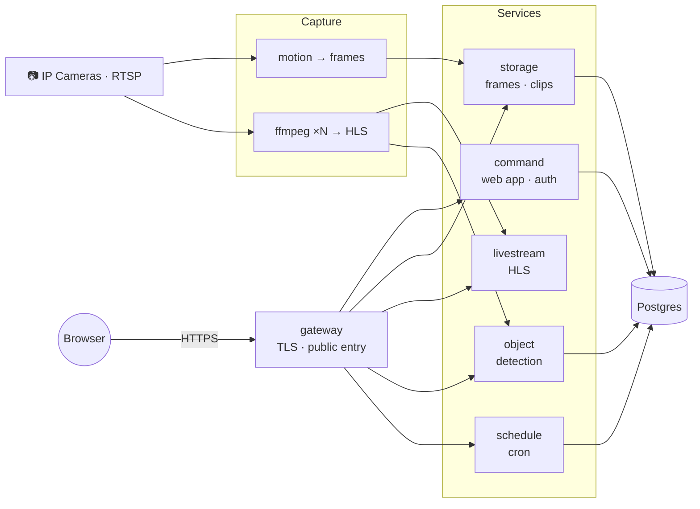

# Chimera


Microservices security-camera system for RTSP/IP cameras.


```mermaid
flowchart LR
    user(("Browser"))
    cam["📷 IP Cameras · RTSP"]

    gw["gateway<br/>TLS · public entry"]

    subgraph cap [Capture]
      motion["motion → frames"]
      ff["ffmpeg ×N → HLS"]
    end

    subgraph svcs [Services]
      cmd["command<br/>web app · auth"]
      store["storage<br/>frames · clips"]
      live["livestream<br/>HLS"]
      obj["object<br/>detection"]
      sched["schedule<br/>cron"]
    end

    db[("Postgres")]

    user -->|HTTPS| gw
    cam --> motion & ff
    motion --> store
    ff --> live & obj
    gw --> cmd & store & live & obj & sched
    store & cmd & obj & sched --> db
```

## Services

| | |
|---|---|
| [command](command) | Web app · auth · RBAC · sessions |
| [storage](storage) | Saves motion frames · builds clips & zips · quota |
| [livestream](livestream) | Per-camera HLS streams |
| [object](object) | YOLOX detection on feeds · webhook alerts |
| [schedule](schedule) | Cron jobs (auto-cleanup, etc.) |
| [gateway](gateway) | Public entrypoint · reverse proxy · TLS |
| [memory](memory) | Shared state across a pm2 cluster |

Each service is toggled by `<prefix>_ON`. The gateway is the only public port.

**Shared:** [lib](lib) (helpers every service imports) · [chimera](chimera) (boot scripts)<br>
**Bundled in the image:** motion · ffmpeg · heartbeat · postgres

## Quick start

> **Docker only.** The image bundles motion, ffmpeg, Node, pm2 and pins `TZ=UTC` (required — non-UTC misaligns clips/frames). Postgres runs as a side container. Needs Docker Compose v2.23.1 or newer for the `secrets.environment` source.

**On the host you need:** Docker, plus Node >= 22 and npm >= 7. The image builds and runs the services, but preflight runs on the host before every build — and it needs the dependencies `npm install` puts there.

```bash
npm install                            # install the tools the build uses
cp env.example .env                    # fill in values
cp motion.conf.example motion.conf
# add cameraconf/camN.conf per camera  (see cameraconf/camera.conf.example)

npm run docker:build                   # runs preflight first — missing/mistyped config blocks the build
npm run docker:up
```

Preflight checks your config before the build. It finds values that are missing, of the wrong type, or in the wrong format, and it rejects a `setup_TOKEN` shorter than 32 characters. It also hard-fails the build if `command_COOKIE_SECURE` is not `true` while `gateway_HOST` names an HTTPS host, `gateway_HTTPS_Redirect` is `true`, or `certbot_ON` is `true` — set `command_COOKIE_SECURE` to `true`, or, for a plain-HTTP deploy, give `gateway_HOST` an explicit `http://` scheme and leave `gateway_HTTPS_Redirect` and `certbot_ON` both `false`. The same check runs again at container boot, in case `.env` changed after the build. Some checks run later, inside the container at boot: the length of `SECRETKEY`, the `*_URL` addresses, and file paths. A build can pass preflight and still stop at startup.

**`.env` and `motion.conf` permissions:** the app runs as a non-root user inside the container, so it must be able to read both files. It stops with `CANNOT READ` if it cannot open one. Use `cp` — it sets the right permissions. Do not run `chmod 600` on them, and do not create them with `sudo`.

This applies when the project folder is on a Linux file system: a native Linux host, or a folder inside a WSL distro such as `\\wsl$\Ubuntu\home\you\chimera`. It does not apply when the folder is on a Mac or Windows drive, such as `C:\Users\you\chimera` or `/mnt/c/Users/you/chimera`, because Docker Desktop gives the container its own ownership for those files.

**First run:** no users exist yet. Open the gateway and create the first admin from the setup screen.

**Signing in:** a successful login leaves a second cookie on that device for one year. It only tells the login limits that the device is known, so a password-guessing attack cannot lock you out of it. Changing that user's password clears the cookie on every device — do that if a device is lost. See [login limits](command#login-limits).

<details>
<summary><b>Commands</b></summary>

| | |
|---|---|
| `npm run preflight` | Seed & validate config |
| `npm run docker:up` | Start |
| `npm run docker:down` | Stop |
| `npm run docker:logs` | Tail logs |
| `npm run docker:rebuild` | Redeploy |
| `npm run docker:delete` | Stop + wipe volumes |

</details>

<details>
<summary><b>Boot & scaling</b></summary>

- **Boot chain** ([entrypoint.sh](entrypoint.sh), aborts on first failure): ACME dir → `validateEnvVars.js` → `prepareDatabase.js` → `pm2-runtime`.
- One pm2 process per enabled service ([pm2.config.js](pm2.config.js)); crashes restart per-process, no cross-service chaining.
- `object` and `memory` are single-instance; the rest honor `chimeraInstances`.
- `object` reads its frames from the livestream feeds, so `object_ON=true` needs `livestream_ON=true` — anything else fails the boot chain. It also makes `livestream_FOLDERPATH` (frames in) and `storage_FOLDERPATH` (`objectCaptures/` out) required, even when `storage_ON=false`.
- **`chimeraInstances`:** `1` = single process. `max` / `0` / `-1` / any integer `>1` = cluster — forces `memory_ON=true` so instances share state via the memory socket. Any other value is rejected at boot.
- The container caps default to `mem_limit` 2g and `pids_limit` 512, which fit a single instance. A cluster needs both raised via `chimera_MEM_LIMIT` / `chimera_PIDS_LIMIT` in `.env`, or it is OOM-killed at boot. Budget the pids cap past the process count — the cgroup counts threads, and motion's `on_picture_save` forks five processes per saved frame.
- In production pm2 writes no log files; everything streams to container stdout, rotated by the `json-file` driver (`npm run docker:logs`).
- `chimera` has no `DAC_OVERRIDE`, so `docker compose exec chimera pm2 list` fails as root — use `docker compose exec -u node chimera pm2 list`.

</details>

<details>
<summary><b>TLS renewal</b></summary>

`certbot_ON=true` auto-issues + renews Let's Encrypt certs (HTTP-01, needs `gateway_PORT=80`); the gateway self-restarts nightly to load them. Disable for BYO certs / upstream TLS.

</details>

<details>
<summary><b>Database schema</b></summary>

Created by [prepareDatabase.js](chimera/prepareDatabase.js): tables/indexes are created if missing, and an existing table's column names (not types) are checked against what's expected rather than assumed correct. Full config in [env.example](env.example).

| Tables | Owner |
|---|---|
| `frame_files` · `frame_deletes` | storage |
| `auth` · `sessions` | command |
| `objects_detected` | object |
| `task_runs` | schedule |

</details>
