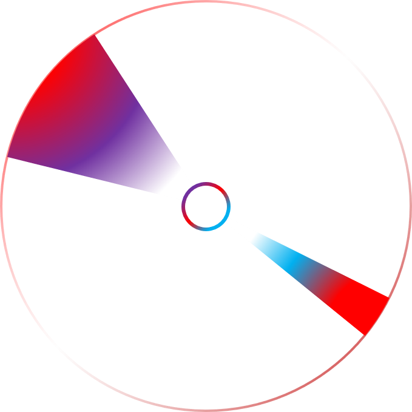

# Schedule  

The scheduler is pretty self explanatory. You need a task scheduled? Done.

## ▶ /task

|Type|Route|Description|Parameters|Returns|
| :-|:- |:-:|:-:|:-:|
|POST|/schedule|Schedules a request for another command server request|`{ url: String, body: JSON, cronString: String }`|`{ cronString: String, set: Boolean, destroyed: Boolean }`|
|POST|/check|Checks details of tasks|`{ url: String }`|`{ cronString: String, set: Boolean }`
|POST|/destroy|Destroys a scheduled request process|`{ url: String }`|`{ set: Boolean, destroyed: Boolean }`|